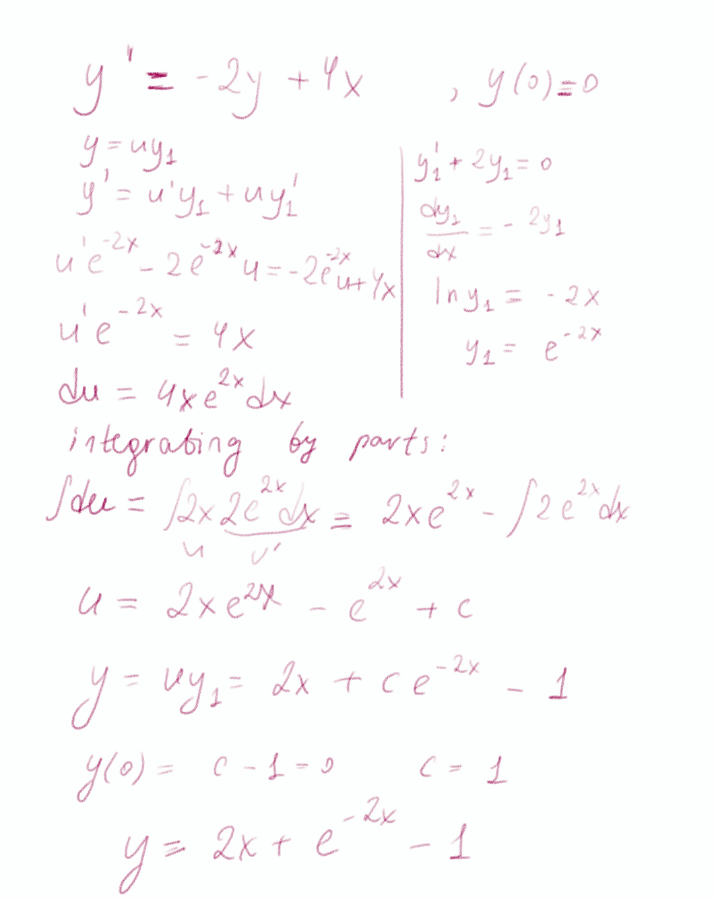
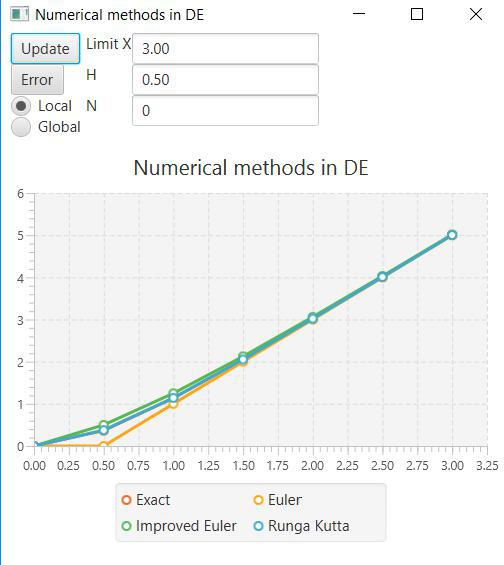

#   Differential Equation Graph Plotting Application

This app shows how different numeric methods (Euler, Improved Euler, Runge-Kutta) can be used to solve a first-order DE` y'= -2y + 4x` and also plots graph of its analytical solution to compare results and show effectiveness of each method.
***
Application was written on Java, using JavaFx libraries to construct GUI, where you have an ability to change end of the interval, step between x values and maximum number of steps to calculate the global error.
***

## Initial Value Problem

```angular2html
y` = -2y + 4x
y(0) = 0 
x belongs to [0;X]
```
Solved analytically
***


## Numerical method solutions
After studying what Euler, Improved Euler, Runge-Kutta methods are, it was not difficult to implement functions computing them on Java.

For every method there writen functions which are updating when user changes the data.

***
My function at given initial values:


All methods give almost the same result, but when we compare them the difference is more visible:

